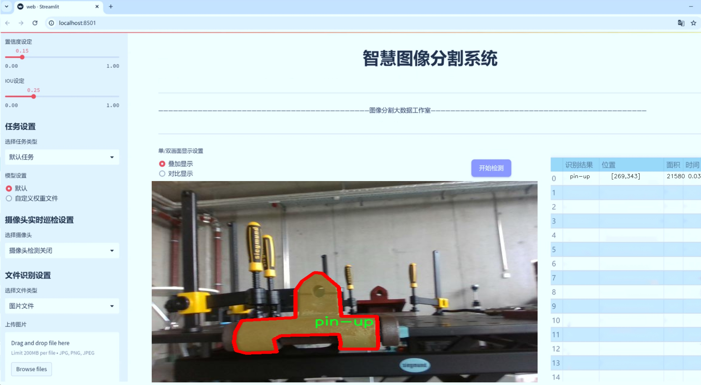
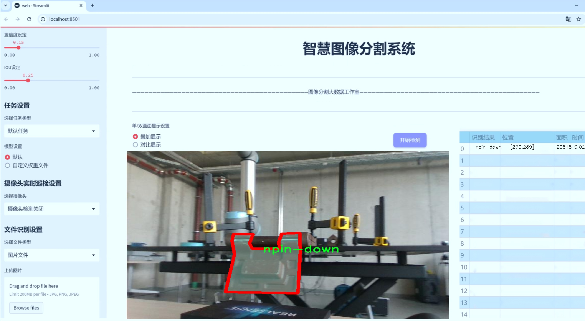
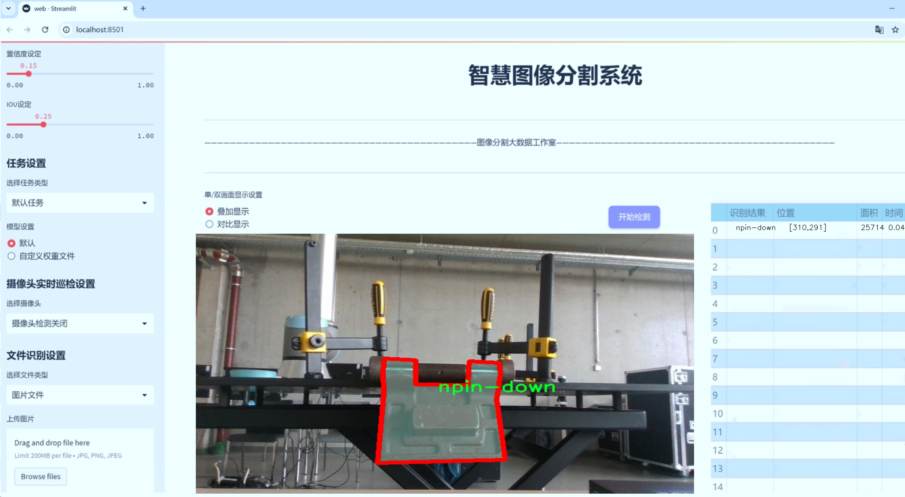
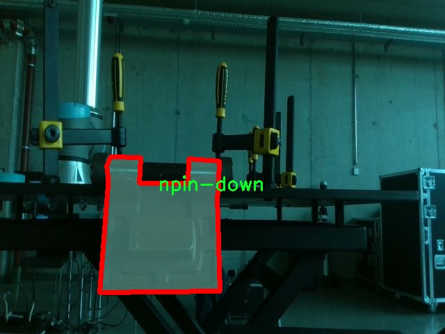
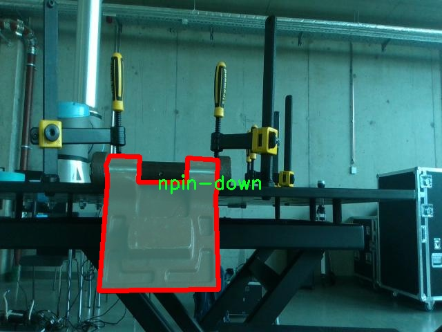
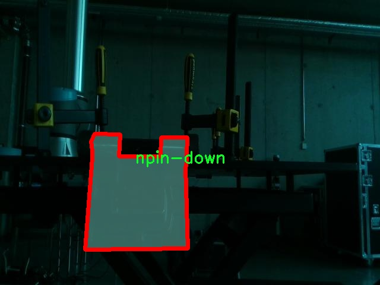
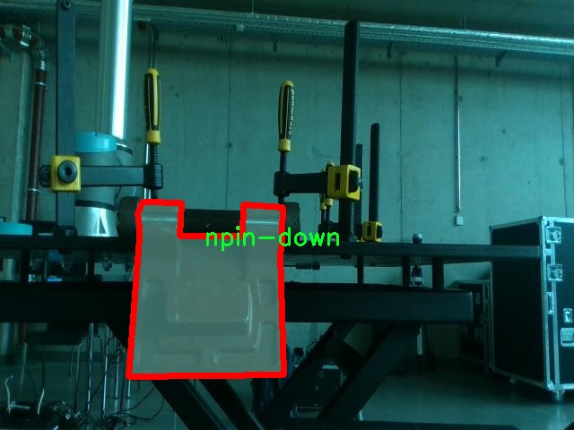
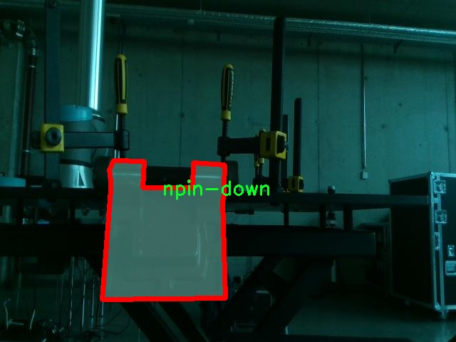

# 针脚处理图像分割系统： yolov8-seg-act

### 1.研究背景与意义

[参考博客](https://gitee.com/YOLOv8_YOLOv11_Segmentation_Studio/projects)

[博客来源](https://kdocs.cn/l/cszuIiCKVNis)

研究背景与意义

随着计算机视觉技术的迅猛发展，图像分割作为其中一个重要的研究方向，逐渐在各个领域展现出其广泛的应用潜力。尤其是在工业自动化、智能制造以及机器人技术等领域，精准的图像分割技术对于提高生产效率、降低人力成本以及提升产品质量具有重要意义。针脚处理作为电子元器件组装过程中的关键环节，涉及到对不同类型针脚的识别与处理，因而需要高效且准确的图像分割技术来支持这一过程。

在传统的针脚处理方法中，往往依赖于人工视觉判断或简单的图像处理算法，这不仅效率低下，而且容易受到环境因素的影响，导致识别错误和处理延误。为了解决这一问题，基于深度学习的图像分割技术逐渐成为研究的热点。YOLO（You Only Look Once）系列模型因其优越的实时性和准确性，已被广泛应用于目标检测和图像分割任务中。YOLOv8作为该系列的最新版本，进一步提升了模型的性能，特别是在处理复杂场景和多类别目标时，展现出更强的适应能力。

本研究旨在基于改进的YOLOv8模型，构建一个高效的针脚处理图像分割系统。我们将利用包含5200张图像的专用数据集，该数据集涵盖了四类针脚（pin1-down、pin1-up、pin2-down、pin2-up），为模型的训练和验证提供了丰富的样本。通过对数据集的深入分析与处理，我们期望能够提高模型对不同针脚状态的识别精度，从而实现更为精准的图像分割效果。

在研究过程中，我们将重点关注数据增强、模型优化及后处理技术的应用，以提高模型在实际应用中的鲁棒性和准确性。数据增强技术将帮助我们在有限的样本上扩展模型的泛化能力，而模型优化则将通过调整网络结构和超参数设置，进一步提升分割性能。此外，后处理技术的引入将有助于消除分割结果中的噪声，提高最终输出的质量。

本研究的意义不仅在于推动针脚处理领域的技术进步，更在于为其他工业应用提供借鉴。通过构建一个高效的图像分割系统，我们希望能够为智能制造和自动化设备的开发提供理论基础和技术支持。同时，本研究的成果也将为相关领域的研究者提供有价值的数据集和模型参考，促进计算机视觉技术在实际应用中的进一步发展。

综上所述，基于改进YOLOv8的针脚处理图像分割系统的研究，不仅具有重要的学术价值，更具备广泛的应用前景。通过深入探索和创新，我们期待能够为工业自动化和智能制造的未来发展贡献一份力量。

### 2.图片演示







注意：本项目提供完整的训练源码数据集和训练教程,由于此博客编辑较早,暂不提供权重文件（best.pt）,需要按照6.训练教程进行训练后实现上图效果。

### 3.视频演示

[3.1 视频演示](https://www.bilibili.com/video/BV1BAUfYdEDJ/)

### 4.数据集信息

##### 4.1 数据集类别数＆类别名

nc: 3
names: ['npin-down', 'pin-up', 'stdpin-down']


##### 4.2 数据集信息简介

数据集信息展示

在本研究中，我们采用了名为“Pin-handling”的数据集，以支持对YOLOv8-seg模型在针脚处理图像分割任务中的改进与优化。该数据集专门设计用于训练和评估针脚处理相关的图像分割系统，旨在提高模型在实际应用中的表现。数据集的类别数量为3，具体类别包括“npin-down”、“pin-up”和“stdpin-down”，这些类别涵盖了针脚在不同状态下的视觉特征，能够有效地帮助模型学习到针脚的形态变化和位置特征。

“Pin-handling”数据集的构建基于对针脚处理过程的深入分析，涵盖了针脚在不同操作下的多样化表现。首先，“npin-down”类别代表了针脚处于放置状态的图像，这种状态通常出现在针脚被放置在工作台或其他表面上时。该类别的图像特征包括针脚的侧面视图，通常具有较强的背景对比度，以便于模型识别针脚的轮廓和形状。其次，“pin-up”类别则描述了针脚被提起或悬空的状态，这种状态下，针脚的角度和位置变化可能会对后续的处理操作产生重要影响。该类别的图像通常包含针脚与背景之间的动态交互，能够帮助模型学习到针脚在不同操作中的相对位置变化。最后，“stdpin-down”类别则是标准针脚放置状态的代表，通常用于作为基准状态进行比较和分析。该类别的图像特征相对稳定，适合用于模型的基础训练。

数据集的多样性和丰富性是其成功的关键。每个类别中的图像均经过精心挑选和标注，确保涵盖了各种可能的场景和条件。这种多样性不仅提高了模型的泛化能力，还增强了其在实际应用中的鲁棒性。通过使用“Pin-handling”数据集，YOLOv8-seg模型能够更好地理解针脚在不同操作下的表现，从而实现更高效的图像分割。

此外，为了进一步提升模型的性能，我们还在数据集中引入了数据增强技术，包括旋转、缩放、翻转等操作。这些技术的应用不仅增加了训练样本的数量，还丰富了样本的多样性，使得模型在面对不同环境和条件时，能够更好地适应和应对。通过这些方法，我们期望能够显著提高YOLOv8-seg模型在针脚处理图像分割任务中的准确性和效率。

综上所述，“Pin-handling”数据集为针脚处理图像分割系统的训练提供了坚实的基础。其精心设计的类别和丰富的图像样本，使得YOLOv8-seg模型能够在复杂的实际应用中，准确地识别和分割针脚，从而推动针脚处理技术的发展和应用。随着研究的深入，我们期待这一数据集能够为未来的相关研究提供更多的启示和支持。











### 5.项目依赖环境部署教程（零基础手把手教学）

[5.1 环境部署教程链接（零基础手把手教学）](https://www.bilibili.com/video/BV1jG4Ve4E9t/?vd_source=bc9aec86d164b67a7004b996143742dc)


[5.2 安装Python虚拟环境创建和依赖库安装视频教程链接（零基础手把手教学）](https://www.bilibili.com/video/BV1nA4VeYEze/?vd_source=bc9aec86d164b67a7004b996143742dc)

### 6.手把手YOLOV8-seg训练视频教程（零基础手把手教学）

[6.1 手把手YOLOV8-seg训练视频教程（零基础小白有手就能学会）](https://www.bilibili.com/video/BV1cA4VeYETe/?vd_source=bc9aec86d164b67a7004b996143742dc)


按照上面的训练视频教程链接加载项目提供的数据集，运行train.py即可开始训练



     Epoch   gpu_mem       box       obj       cls    labels  img_size
     1/200     0G   0.01576   0.01955  0.007536        22      1280: 100%|██████████| 849/849 [14:42<00:00,  1.04s/it]
               Class     Images     Labels          P          R     mAP@.5 mAP@.5:.95: 100%|██████████| 213/213 [01:14<00:00,  2.87it/s]
                 all       3395      17314      0.994      0.957      0.0957      0.0843

     Epoch   gpu_mem       box       obj       cls    labels  img_size
     2/200     0G   0.01578   0.01923  0.007006        22      1280: 100%|██████████| 849/849 [14:44<00:00,  1.04s/it]
               Class     Images     Labels          P          R     mAP@.5 mAP@.5:.95: 100%|██████████| 213/213 [01:12<00:00,  2.95it/s]
                 all       3395      17314      0.996      0.956      0.0957      0.0845

     Epoch   gpu_mem       box       obj       cls    labels  img_size
     3/200     0G   0.01561    0.0191  0.006895        27      1280: 100%|██████████| 849/849 [10:56<00:00,  1.29it/s]
               Class     Images     Labels          P          R     mAP@.5 mAP@.5:.95: 100%|███████   | 187/213 [00:52<00:00,  4.04it/s]
                 all       3395      17314      0.996      0.957      0.0957      0.0845


### 7.50+种全套YOLOV8-seg创新点加载调参实验视频教程（一键加载写好的改进模型的配置文件）

[7.1 50+种全套YOLOV8-seg创新点加载调参实验视频教程（一键加载写好的改进模型的配置文件）](https://www.bilibili.com/video/BV1Hw4VePEXv/?vd_source=bc9aec86d164b67a7004b996143742dc)

### YOLOV8-seg算法简介

原始YOLOv8-seg算法原理

YOLOv8-seg算法是YOLO系列中的最新版本，结合了目标检测与图像分割的能力，旨在为计算机视觉领域提供更为精准和高效的解决方案。该算法在YOLOv8的基础上，融入了分割技术，使其不仅能够识别图像中的目标，还能对目标进行像素级的分割，从而在多种应用场景中展现出更强的适应性和实用性。

首先，YOLOv8-seg算法的整体架构与YOLOv8保持一致，依然由输入层、主干网络、颈部网络和头部网络构成。输入层负责将原始图像缩放至指定尺寸，以满足网络的输入要求。接下来，主干网络通过一系列卷积操作对图像进行特征提取。与以往版本相比，YOLOv8-seg在主干网络中引入了更深的卷积神经网络结构，并通过批归一化和SiLUR激活函数来增强特征提取的效果。这种设计不仅提高了模型的表达能力，还在一定程度上缓解了梯度消失的问题。

在特征提取过程中，YOLOv8-seg采用了C2f块，这一模块借鉴了YOLOv7中的E-ELAN结构，通过跨层分支连接的方式来增强模型的梯度流。这种设计理念使得网络能够更好地捕捉到不同层次的特征信息，从而提高了目标检测和分割的精度。此外，主干网络末尾的SPPFl块通过三个最大池化层的组合，进一步增强了网络对多尺度特征的处理能力。这种多尺度特征的提取方式对于复杂场景中的目标检测和分割尤为重要，因为它能够有效地应对目标大小和形状的变化。

颈部网络在YOLOv8-seg中同样发挥着重要作用。它利用特征金字塔网络（FPN）和路径聚合网络（PAN）结构，融合来自不同尺度的特征图信息。通过这种融合，YOLOv8-seg能够在多层次上进行信息的整合，从而提升目标检测和分割的整体性能。颈部网络的设计旨在将不同层次的特征有效地传递给头部网络，使得后续的检测和分割任务能够充分利用多层次的特征信息。

在头部网络中，YOLOv8-seg采用了解耦的检测头，通过两个并行的卷积分支分别计算回归和类别的损失。这种设计不仅提高了模型的计算效率，还使得目标检测和分割任务能够更为独立地进行优化。此外，YOLOv8-seg引入了新的损失策略，包括变焦损失、数据平均保真度损失和完美交并比损失。这些新颖的损失函数能够更准确地反映目标的分类和定位精度，从而进一步提升模型的性能。

值得注意的是，YOLOv8-seg在图像分割方面的创新使其在目标检测的基础上，具备了像素级的分割能力。这一特性对于许多实际应用场景，如自动驾驶、医学影像分析和智能监控等，具有重要的意义。通过对目标进行精确的分割，YOLOv8-seg能够提供更为丰富的信息，帮助决策系统做出更为准确的判断。

此外，YOLOv8-seg在算法的轻量化设计上也做出了显著的改进。通过优化特征提取网络的结构，减少冗余计算，YOLOv8-seg在保证检测精度的同时，显著提升了处理速度。这一特性使得YOLOv8-seg能够在资源受限的环境中，依然保持高效的性能表现，适用于实时目标检测和分割的需求。

总的来说，YOLOv8-seg算法通过对YOLOv8的优化与改进，结合了目标检测与图像分割的优势，展现出强大的性能和广泛的应用潜力。其深度卷积神经网络结构、跨层特征融合机制以及新颖的损失策略，使得YOLOv8-seg在处理复杂场景时，能够更为精准地识别和分割目标。这一算法的推出，不仅为计算机视觉领域的研究提供了新的思路，也为实际应用中的智能系统提供了更为可靠的技术支持。随着YOLOv8-seg的不断发展与完善，未来在各类智能应用中，其重要性和影响力将愈加凸显。


### 9.系统功能展示（检测对象为举例，实际内容以本项目数据集为准）

图9.1.系统支持检测结果表格显示

  图9.2.系统支持置信度和IOU阈值手动调节

  图9.3.系统支持自定义加载权重文件best.pt(需要你通过步骤5中训练获得)

  图9.4.系统支持摄像头实时识别

  图9.5.系统支持图片识别

  图9.6.系统支持视频识别

  图9.7.系统支持识别结果文件自动保存

  图9.8.系统支持Excel导出检测结果数据


### 10.50+种全套YOLOV8-seg创新点原理讲解（非科班也可以轻松写刊发刊，V11版本正在科研待更新）

#### 10.1 由于篇幅限制，每个创新点的具体原理讲解就不一一展开，具体见下列网址中的创新点对应子项目的技术原理博客网址【Blog】：


[10.1 50+种全套YOLOV8-seg创新点原理讲解链接](https://gitee.com/qunmasj/good)

#### 10.2 部分改进模块原理讲解(完整的改进原理见上图和技术博客链接)【如果此小节的图加载失败可以通过CSDN或者Github搜索该博客的标题访问原始博客，原始博客图片显示正常】

### YOLOv8模型
YOLOv8模型由Ultralytics团队在YOLOv5模型的基础上，吸收了近两年半来经过实际验证的各种改进，于2023年1月提出。与之前的一些YOLO 系列模型想类似，YOLOv8模型也有多种尺寸，下面以YOLOv8n为例，分析 YOLOv8模型的结构和改进点。YOLOv8模型网络结构如
输入图片的部分，由于发现Mosaic数据增强尽管这有助于提升模型的鲁棒性和泛化性，但是，在一定程度上，也会破坏数据的真实分布，使得模型学习到一些不好的信息。所以YOLOv8模型在训练中的最后10个epoch 停止使用Mosaic数据增强。


在网络结构上，首先主干网络的改变不大，主要是将C3模块替换为了C2f模块，该模块的结构在上图中已示出。C2f模块在C3模块的思路基础上，引入了YOLOv7中 ELAN的思路，引入了更多的跳层连接，这有助于该模块获得更丰富的梯度流信息，而且模型的轻量化得到了保证。依然保留了SPPF，效果不变的同时减少了该模块的执行时间。
在颈部网络中，也是将所有的C3模块更改为C2f模块，同时删除了两处上采样之前的卷积连接层。
在头部网络中，采用了YOLOX中使用的解耦头的思路，两条并行的分支分别提取类别和位置特征。由于分类任务更注重于分析特征图中提取到的特征与已输入图片的部分，由于发现 Mosaic数据增强尽管这有助于提升模型的鲁棒性和泛化性，但是，在一定程度上，也会破坏数据的真实分布，使得模型学习到一些不好的信息。所以YOLOv8模型在训练中的最后10个epoch停止使用Mosaic数据增强。
在网络结构上，首先主干网络的改变不大，主要是将C3模块替换为了C2f模块，该模块的结构在上图中已示出。C2f模块在C3模块的思路基础上，引入了YOLOv7中ELAN的思路，引入了更多的跳层连接，这有助于该模块获得更丰富的梯度流信息，而且模型的轻量化得到了保证。依然保留了SPPF，效果不变的同时减少了该模块的执行时间。
在颈部网络中，也是将所有的C3模块更改为C2f模块，同时删除了两处上采样之前的卷积连接层。
在头部网络中，采用了YOLOX中使用的解耦头的思路，两条并行的分支分别提取类别和位置特征。由于分类任务更注重于分析特征图中提取到的特征与已有类别中的哪一种更为相似，而定位任务更关注边界框与真值框的位置关系，并据此对边界框的坐标进行调整。侧重点的不同使得在使用两个检测头时收敛的速度和预测的精度有所提高。而且使用了无锚框结构，直接预测目标的中心，并使用TAL (Task Alignment Learning，任务对齐学习）来区分正负样本，引入了分类分数和IOU的高次幂乘积作为衡量任务对齐程度的指标，认为同时拥有好的定位和分类评价的在分类和定位损失函数中也引入了这项指标。
在模型的检测结果上，YOLOv8模型也取得了较好的成果，图为官方在coCO数据集上 YOLOv8模型的模型尺寸大小和检测的mAP50-95对比图。mAP50-95指的是IOU的值从50%取到95%，步长为5%，然后算在这些IOU下的mAP的均值。图的 a）图展示了YOLOv8在同尺寸下模型中参数没有较大增加的前提下取得了比其他模型更好的精度，图2-17的b)图展示了YOLOv8比其他YOLO系列模型在同尺寸时，推理速度更快且精度没有太大下降。


### 视觉transformer(ViT)简介
视觉transformer(ViT)最近在各种计算机视觉任务中证明了巨大的成功，并受到了相当多的关注。与卷积神经网络(CNNs)相比，ViT具有更强的全局信息捕获能力和远程交互能力，表现出优于CNNs的准确性，特别是在扩大训练数据大小和模型大小时[An image is worth 16x16 words: Transformers for image recognition at scale,Coatnet]。

尽管ViT在低分辨率和高计算领域取得了巨大成功，但在高分辨率和低计算场景下，ViT仍不如cnn。例如，下图(左)比较了COCO数据集上当前基于cnn和基于vit的一级检测器。基于vit的检测器(160G mac)和基于cnn的检测器(6G mac)之间的效率差距超过一个数量级。这阻碍了在边缘设备的实时高分辨率视觉应用程序上部署ViT。


左图:现有的基于vit的一级检测器在实时目标检测方面仍然不如当前基于cnn的一级检测器，需要的计算量多出一个数量级。本文引入了第一个基于vit的实时对象检测器来弥补这一差距。在COCO上，efficientvit的AP比efficientdet高3.8，而mac较低。与YoloX相比，efficient ViT节省67.2%的计算成本，同时提供更高的AP。

中:随着输入分辨率的增加，计算成本呈二次增长，无法有效处理高分辨率的视觉应用。

右图:高分辨率对图像分割很重要。当输入分辨率从1024x2048降低到512x1024时，MobileNetV2的mIoU减少12% (8.5 mIoU)。在不提高分辨率的情况下，只提高模型尺寸是无法缩小性能差距的。

ViT的根本计算瓶颈是softmax注意模块，其计算成本随输入分辨率的增加呈二次增长。例如，如上图(中)所示，随着输入分辨率的增加，vit- small[Pytorch image models. https://github.com/rwightman/ pytorch-image-models]的计算成本迅速显著大于ResNet-152的计算成本。

解决这个问题的一个直接方法是降低输入分辨率。然而，高分辨率的视觉识别在许多现实世界的计算机视觉应用中是必不可少的，如自动驾驶，医疗图像处理等。当输入分辨率降低时，图像中的小物体和精细细节会消失，导致目标检测和语义分割性能显著下降。

上图(右)显示了在cityscape数据集上不同输入分辨率和宽度乘法器下MobileNetV2的性能。例如，将输入分辨率从1024x2048降低到512x1024会使cityscape的性能降低12% (8.5 mIoU)。即使是3.6倍高的mac，只放大模型尺寸而不增加分辨率也无法弥补这一性能损失。

除了降低分辨率外，另一种代表性的方法是限制softmax注意，方法是将其范围限制在固定大小的局部窗口内[Swin transformer,Swin transformer v2]或降低键/值张量的维数[Pyramid vision transformer,Segformer]。然而，它损害了ViT的非局部注意能力，降低了全局接受域(ViT最重要的优点)，使得ViT与大内核cnn的区别更小[A convnet for the 2020s,Scaling up your kernels to 31x31: Revisiting large kernel design in cnns,Lite pose: Efficient architecture design for 2d human pose estimation]。

本文介绍了一个有效的ViT体系结构，以解决这些挑战。发现没有必要坚持softmax注意力。本文建议用线性注意[Transformers are rnns: Fast autoregressive transformers with linear attention]代替softmax注意。

线性注意的关键好处是，它保持了完整的n 2 n^2n 2
 注意映射，就像softmax注意。同时，它利用矩阵乘法的联想特性，避免显式计算完整的注意映射，同时保持相同的功能。因此，它保持了softmax注意力的全局特征提取能力，且计算复杂度仅为线性。线性注意的另一个关键优点是它避免了softmax，这使得它在移动设备上更有效(下图左)。


左图:线性注意比类似mac下的softmax注意快3.3-4.5倍，这是因为去掉了硬件效率不高的softmax功能。延迟是在Qualcomm Snapdragon 855 CPU和TensorFlow-Lite上测量的。本文增加线性注意的头部数量，以确保它具有与softmax注意相似的mac。

中:然而，如果没有softmax注意中使用的非线性注意评分归一化，线性注意无法有效集中其注意分布，削弱了其局部特征提取能力。后文提供了可视化。

右图:本文用深度卷积增强线性注意，以解决线性注意的局限性。深度卷积可以有效地捕捉局部特征，而线性注意可以专注于捕捉全局信息。增强的线性注意在保持线性注意的效率和简单性的同时，表现出在各种视觉任务上的强大表现(图4)。

然而，直接应用线性注意也有缺点。以往的研究表明线性注意和softmax注意之间存在显著的性能差距(下图中间)。


左:高通骁龙855上的精度和延迟权衡。效率vit比效率网快3倍，精度更高。中:ImageNet上softmax注意与线性注意的比较。在相同的计算条件下，本文观察到softmax注意与线性注意之间存在显著的精度差距。而深度卷积增强模型后，线性注意的精度有明显提高。

相比之下，softmax注意的精度变化不大。在相同MAC约束下，增强线性注意比增强软最大注意提高了0.3%的精度。右图:与增强的softmax注意相比，增强的线性注意硬件效率更高，随着分辨率的增加，延迟增长更慢。

深入研究线性注意和softmax注意的详细公式，一个关键的区别是线性注意缺乏非线性注意评分归一化方案。这使得线性注意无法有效地将注意力分布集中在局部模式产生的高注意分数上，从而削弱了其局部特征提取能力。

本文认为这是线性注意的主要限制，使其性能不如softmax注意。本文提出了一个简单而有效的解决方案来解决这一限制，同时保持线性注意在低复杂度和低硬件延迟方面的优势。具体来说，本文建议通过在每个FFN层中插入额外的深度卷积来增强线性注意。因此，本文不需要依赖线性注意进行局部特征提取，避免了线性注意在捕捉局部特征方面的不足，并利用了线性注意在捕捉全局特征方面的优势。

本文广泛评估了efficient vit在低计算预算下对各种视觉任务的有效性，包括COCO对象检测、城市景观语义分割和ImageNet分类。本文想要突出高效的主干设计，所以没有包括任何正交的附加技术(例如，知识蒸馏，神经架构搜索)。尽管如此，在COCO val2017上，efficientvit的AP比efficientdet - d1高2.4倍，同时节省27.9%的计算成本。在cityscape上，efficientvit提供了比SegFormer高2.5个mIoU，同时降低了69.6%的计算成本。在ImageNet上，efficientvit在584M mac上实现了79.7%的top1精度，优于efficientnet - b1的精度，同时节省了16.6%的计算成本。

与现有的以减少参数大小或mac为目标的移动ViT模型[Mobile-former,Mobilevit,NASVit]不同，本文的目标是减少移动设备上的延迟。本文的模型不涉及复杂的依赖或硬件低效操作。因此，本文减少的计算成本可以很容易地转化为移动设备上的延迟减少。

在高通骁龙855 CPU上，efficient vit运行速度比efficientnet快3倍，同时提供更高的ImageNet精度。本文的代码和预训练的模型将在出版后向公众发布。

### Efficient Vision Transformer.
提高ViT的效率对于在资源受限的边缘平台上部署ViT至关重要，如手机、物联网设备等。尽管ViT在高计算区域提供了令人印象深刻的性能，但在针对低计算区域时，它通常不如以前高效的cnn[Efficientnet, mobilenetv3,Once for all: Train one network and specialize it for efficient deployment]。为了缩小差距，MobileViT建议结合CNN和ViT的长处，使用transformer将卷积中的局部处理替换为全局处理。MobileFormer提出了在MobileNet和Transformer之间建立双向桥以实现特征融合的并行化。NASViT提出利用神经架构搜索来搜索高效的ViT架构。

这些模型在ImageNet上提供了极具竞争力的准确性和效率的权衡。然而，它们并不适合高分辨率的视觉任务，因为它们仍然依赖于softmax注意力。


在本节中，本文首先回顾了自然语言处理中的线性注意，并讨论了它的优缺点。接下来，本文介绍了一个简单而有效的解决方案来克服线性注意的局限性。最后，给出了efficient vit的详细架构。

 为可学习投影矩阵。Oi表示矩阵O的第i行。Sim(·，·)为相似度函数。

虽然softmax注意力在视觉和NLP方面非常成功，但它并不是唯一的选择。例如，线性注意提出了如下相似度函数:


其中，φ(·)为核函数。在本工作中，本文选择了ReLU作为内核函数，因为它对硬件来说是友好的。当Sim(Q, K) = φ(Q)φ(K)T时，式(1)可改写为:


线性注意的一个关键优点是，它允许利用矩阵乘法的结合律，在不改变功能的情况下，将计算复杂度从二次型降低到线性型:


除了线性复杂度之外，线性注意的另一个关键优点是它不涉及注意模块中的softmax。Softmax在硬件上效率非常低。避免它可以显著减少延迟。例如，下图(左)显示了softmax注意和线性注意之间的延迟比较。在类似的mac上，线性注意力比移动设备上的softmax注意力要快得多。


#### EfficientViT
Enhancing Linear Attention with Depthwise Convolution

虽然线性注意在计算复杂度和硬件延迟方面优于softmax注意，但线性注意也有局限性。以往的研究[\[Luna: Linear unified nested attention,Random feature attention,Combiner: Full attention transformer with sparse computation cost,cosformer: Rethinking softmax in attention\]](https://afdian.net/item/602b9612927111ee9ec55254001e7c00)表明，在NLP中线性注意和softmax注意之间通常存在显著的性能差距。对于视觉任务，之前的研究[Visual correspondence hallucination,Quadtree attention for vision transformers]也表明线性注意不如softmax注意。在本文的实验中，本文也有类似的观察结果(图中)。


本文对这一假设提出了质疑，认为线性注意的低劣性能主要是由于局部特征提取能力的丧失。如果没有在softmax注意中使用的非线性评分归一化，线性注意很难像softmax注意那样集中其注意分布。下图(中间)提供了这种差异的示例。


在相同的原始注意力得分下，使用softmax比不使用softmax更能集中注意力。因此，线性注意不能有效地聚焦于局部模式产生的高注意分数(下图)，削弱了其局部特征提取能力。


注意图的可视化显示了线性注意的局限性。通过非线性注意归一化，softmax注意可以产生清晰的注意分布，如中间行所示。相比之下，线性注意的分布相对平滑，使得线性注意在捕捉局部细节方面的能力较弱，造成了显著的精度损失。本文通过深度卷积增强线性注意来解决这一限制，并有效提高了准确性。

介绍了一个简单而有效的解决方案来解决这个限制。本文的想法是用卷积增强线性注意，这在局部特征提取中是非常有效的。这样，本文就不需要依赖于线性注意来捕捉局部特征，而可以专注于全局特征提取。具体来说，为了保持线性注意的效率和简单性，本文建议在每个FFN层中插入一个深度卷积，这样计算开销很小，同时极大地提高了线性注意的局部特征提取能力。

#### Building Block

下图(右)展示了增强线性注意的详细架构，它包括一个线性注意层和一个FFN层，在FFN的中间插入深度卷积。


与之前的方法[Swin transformer,Coatnet]不同，本文在efficientvit中没有使用相对位置偏差。相对位置偏差虽然可以改善模型的性能，但它使模型容易受到分辨率变化[Segformer]的影响。多分辨率训练或新分辨率下的测试在检测和分割中很常见。去除相对位置偏差使高效率vit对输入分辨率更加灵活。

与之前低计算CNNs[Mobilenetv2,mobilenetv3]的设计不同，本文为下采样块添加了额外的下采样快捷方式。每个下采样快捷方式由一个平均池和一个1x1卷积组成。在本文的实验中，这些额外的下采样快捷方式可以稳定训练效率，提高性能。

#### Macro Architecture

下图说明了efficientvit的宏观体系结构。它由输入 stem 和4级组成。最近的研究[Coatnet,Levit,Early convolutions help transformers see better]表明在早期阶段使用卷积对ViT更好。本文遵循这个设计，在第三阶段开始使用增强的线性注意。


EfficientViT宏观架构。本文从第三阶段开始使用增强的线性注意。P2、P3和P4形成了一个金字塔特征图，用于检测和分割。P4用于分类。

为了突出高效的主干本身，本文对MBConv和FFN使用相同的扩展比e (e = 4)保持超参数简单，对所有深度卷积使用相同的内核大小k(除了输入stem)，对所有层使用相同的激活函数(hard swish)。

P2、P3和P4表示阶段2、3和4的输出，形成了特征图的金字塔。本文按照惯例将P2、P3和P4送至检测头。本文使用Yolov8进行检测。为了分割，本文融合了P2和P4。融合特征被馈送到一个轻量级头，包括几个卷积层，遵循Fast-SCNN。为了分类，本文将P4输入到轻量级头部，与MobileNetV3相同。


### 11.项目核心源码讲解（再也不用担心看不懂代码逻辑）

#### 11.1 ultralytics\utils\tuner.py

以下是对给定代码的核心部分进行提炼和详细注释的版本：

```python
# 导入必要的库
import subprocess
from ultralytics.cfg import TASK2DATA, TASK2METRIC, get_save_dir
from ultralytics.utils import DEFAULT_CFG, DEFAULT_CFG_DICT, LOGGER, NUM_THREADS

def run_ray_tune(model, space: dict = None, grace_period: int = 10, gpu_per_trial: int = None, max_samples: int = 10, **train_args):
    """
    使用 Ray Tune 进行超参数调优。

    参数:
        model (YOLO): 要进行调优的模型。
        space (dict, optional): 超参数搜索空间。默认为 None。
        grace_period (int, optional): ASHA 调度器的宽限期（以 epoch 为单位）。默认为 10。
        gpu_per_trial (int, optional): 每个试验分配的 GPU 数量。默认为 None。
        max_samples (int, optional): 要运行的最大试验次数。默认为 10。
        train_args (dict, optional): 传递给 `train()` 方法的其他参数。默认为 {}。

    返回:
        (dict): 包含超参数搜索结果的字典。
    """

    # 日志信息，提供 Ray Tune 的学习链接
    LOGGER.info('💡 Learn about RayTune at https://docs.ultralytics.com/integrations/ray-tune')

    # 安装 Ray Tune
    try:
        subprocess.run('pip install ray[tune]'.split(), check=True)
        import ray
        from ray import tune
        from ray.air import RunConfig
        from ray.air.integrations.wandb import WandbLoggerCallback
        from ray.tune.schedulers import ASHAScheduler
    except ImportError:
        raise ModuleNotFoundError('调优超参数需要 Ray Tune. 请使用: pip install "ray[tune]" 安装')

    # 设置默认的超参数搜索空间
    default_space = {
        'lr0': tune.uniform(1e-5, 1e-1),  # 初始学习率
        'lrf': tune.uniform(0.01, 1.0),  # 最终学习率
        'momentum': tune.uniform(0.6, 0.98),  # 动量
        'weight_decay': tune.uniform(0.0, 0.001),  # 权重衰减
        'warmup_epochs': tune.uniform(0.0, 5.0),  # 预热 epoch
        'box': tune.uniform(0.02, 0.2),  # 边框损失增益
        'cls': tune.uniform(0.2, 4.0),  # 分类损失增益
        # 其他数据增强参数...
    }

    # 将模型放入 Ray 存储中
    model_in_store = ray.put(model)

    def _tune(config):
        """
        使用指定的超参数和其他参数训练 YOLO 模型。

        参数:
            config (dict): 用于训练的超参数字典。

        返回:
            None.
        """
        model_to_train = ray.get(model_in_store)  # 从 Ray 存储中获取模型
        model_to_train.reset_callbacks()  # 重置回调
        config.update(train_args)  # 更新配置
        results = model_to_train.train(**config)  # 训练模型
        return results.results_dict  # 返回结果字典

    # 获取搜索空间
    if not space:
        space = default_space  # 如果没有提供搜索空间，则使用默认值
        LOGGER.warning('WARNING ⚠️ 未提供搜索空间，使用默认搜索空间。')

    # 获取数据集
    data = train_args.get('data', TASK2DATA[model.task])  # 从训练参数中获取数据集
    space['data'] = data  # 将数据集添加到搜索空间
    if 'data' not in train_args:
        LOGGER.warning(f'WARNING ⚠️ 未提供数据集，使用默认数据集 "data={data}"。')

    # 定义可训练函数及其资源分配
    trainable_with_resources = tune.with_resources(_tune, {'cpu': NUM_THREADS, 'gpu': gpu_per_trial or 0})

    # 定义 ASHA 调度器
    asha_scheduler = ASHAScheduler(time_attr='epoch',
                                   metric=TASK2METRIC[model.task],
                                   mode='max',
                                   max_t=train_args.get('epochs') or DEFAULT_CFG_DICT['epochs'] or 100,
                                   grace_period=grace_period,
                                   reduction_factor=3)

    # 创建 Ray Tune 超参数搜索调优器
    tune_dir = get_save_dir(DEFAULT_CFG, name='tune').resolve()  # 获取保存目录
    tune_dir.mkdir(parents=True, exist_ok=True)  # 创建目录
    tuner = tune.Tuner(trainable_with_resources,
                       param_space=space,
                       tune_config=tune.TuneConfig(scheduler=asha_scheduler, num_samples=max_samples),
                       run_config=RunConfig(storage_path=tune_dir))

    # 运行超参数搜索
    tuner.fit()

    # 返回超参数搜索的结果
    return tuner.get_results()
```

### 代码核心部分说明：
1. **导入库**：导入必要的库和模块，包括 Ray Tune 和相关的调度器。
2. **函数定义**：`run_ray_tune` 函数用于执行超参数调优，接受模型和其他参数。
3. **超参数空间**：定义了一个默认的超参数搜索空间，包含学习率、动量等。
4. **模型存储**：将模型放入 Ray 的存储中，以便在调优过程中访问。
5. **训练函数**：`_tune` 函数负责使用给定的超参数训练模型，并返回结果。
6. **调度器**：使用 ASHA 调度器来管理超参数搜索过程。
7. **执行调优**：创建调优器并运行超参数搜索，最后返回结果。

通过这些核心部分和注释，可以清晰地理解代码的功能和逻辑。

这个文件是一个用于超参数调优的模块，主要是通过Ray Tune框架来优化YOLO模型的训练参数。文件中首先导入了一些必要的库和模块，包括用于处理超参数的Ray Tune、调度器、日志记录等。

`run_ray_tune`函数是这个模块的核心功能，它接收多个参数来设置超参数调优的过程。主要参数包括模型对象、超参数搜索空间、每个试验的GPU数量、最大样本数等。函数的开头通过日志记录器输出了Ray Tune的相关信息，并尝试安装Ray Tune库，如果没有安装则抛出错误。

在函数内部，定义了一个默认的超参数搜索空间，包括学习率、动量、权重衰减、数据增强参数等。这些参数都是影响模型训练效果的重要因素。接着，将模型放入Ray的存储中，以便在调优过程中能够被访问。

`_tune`函数是一个内部函数，负责根据给定的超参数配置训练YOLO模型。它会从Ray存储中获取模型，重置回调函数，并调用模型的训练方法。

接下来，函数会检查是否提供了超参数搜索空间，如果没有，则使用默认的搜索空间。同时，它还会获取数据集的信息，并将其添加到搜索空间中。

然后，定义了一个可训练的函数，并为其分配计算资源。接着，使用ASHAScheduler定义了一个调度器，用于管理超参数搜索的过程，确保在训练过程中能够有效地选择最优的超参数组合。

最后，创建了Ray Tune的超参数搜索调优器，并运行调优过程。调优完成后，函数会返回超参数搜索的结果。这些结果可以帮助用户了解哪些超参数组合在特定任务上表现最佳，从而提高模型的性能。

#### 11.2 ultralytics\solutions\__init__.py

以下是代码的核心部分，并附上详细的中文注释：

```python
# Ultralytics YOLO 🚀, AGPL-3.0 license

# 导入必要的库
import torch  # 导入PyTorch库，用于深度学习模型的构建和训练
from models.experimental import attempt_load  # 从模型库中导入尝试加载模型的函数
from utils.datasets import LoadImages  # 导入加载图像的数据集工具
from utils.general import check_img_size, non_max_suppression  # 导入图像尺寸检查和非极大值抑制的工具
from utils.torch_utils import select_device  # 导入选择设备的工具（CPU或GPU）

# 选择设备（CPU或GPU）
device = select_device('')  # 根据系统可用性选择设备

# 加载YOLO模型
model = attempt_load('yolov5s.pt', map_location=device)  # 加载预训练的YOLOv5模型

# 检查输入图像的尺寸
img_size = check_img_size(640, s=model.stride.max())  # 检查并调整输入图像的尺寸

# 加载图像
dataset = LoadImages('data/images', img_size=img_size)  # 从指定路径加载图像数据集

# 遍历数据集中的每一张图像
for path, img, im0s, vid_cap in dataset:
    img = torch.from_numpy(img).to(device).float()  # 将图像转换为Tensor并移动到选定设备
    img /= 255.0  # 将图像像素值归一化到[0, 1]范围

    # 进行推理
    pred = model(img[None], augment=False)[0]  # 对图像进行推理，获取预测结果

    # 应用非极大值抑制
    pred = non_max_suppression(pred, conf_thres=0.25, iou_thres=0.45)  # 过滤预测结果，去除冗余框

    # 处理每个检测到的目标
    for det in pred:  # 遍历每个检测结果
        if len(det):  # 如果检测到目标
            # 处理目标的坐标和置信度等信息
            pass  # 此处可以添加代码进行后续处理，如绘制框、保存结果等
```

### 代码说明：
1. **导入库**：代码首先导入了必要的库，包括PyTorch和YOLO模型相关的工具函数。
2. **选择设备**：通过`select_device`函数选择运行模型的设备（CPU或GPU）。
3. **加载模型**：使用`attempt_load`函数加载预训练的YOLOv5模型。
4. **检查图像尺寸**：通过`check_img_size`函数确保输入图像的尺寸符合模型要求。
5. **加载图像数据集**：使用`LoadImages`类从指定路径加载图像。
6. **图像处理和推理**：
   - 将图像转换为Tensor并归一化。
   - 使用模型进行推理，得到预测结果。
7. **非极大值抑制**：通过`non_max_suppression`函数过滤掉冗余的检测框，保留最有可能的目标。
8. **处理检测结果**：遍历每个检测结果，可以在此处添加后续处理代码，例如绘制检测框或保存结果。

该文件是Ultralytics YOLO项目的一部分，文件名为`__init__.py`，它通常用于将一个目录标识为Python包。在这个文件中，包含了一行注释`# Ultralytics YOLO 🚀, AGPL-3.0 license`，这行注释表明了该项目的名称和所使用的许可证类型。

Ultralytics YOLO是一个基于YOLO（You Only Look Once）目标检测算法的实现，广泛应用于计算机视觉领域。YOLO以其高效和实时性著称，适合于各种目标检测任务。AGPL-3.0许可证是一种开源许可证，允许用户自由使用、修改和分发软件，但要求在分发时必须提供源代码，并且在修改后发布的版本也必须使用相同的许可证。

由于该文件是一个`__init__.py`文件，通常它的存在使得Python能够将包含该文件的目录视为一个包，从而可以导入该包中的模块和功能。虽然文件中没有其他代码，但它可能会在包的其他部分中起到初始化的作用，比如设置包的命名空间或导入其他模块。

总的来说，这个文件是Ultralytics YOLO项目结构的一部分，提供了基本的包识别和许可证信息。

#### 11.3 ultralytics\models\rtdetr\__init__.py

以下是保留的核心代码部分，并附上详细的中文注释：

```python
# 导入RTDETR模型类
from .model import RTDETR
# 导入RTDETR预测器类
from .predict import RTDETRPredictor
# 导入RTDETR验证器类
from .val import RTDETRValidator

# 定义模块的公开接口，包含RTDETR模型、预测器和验证器
__all__ = 'RTDETRPredictor', 'RTDETRValidator', 'RTDETR'
```

### 代码注释说明：
1. `from .model import RTDETR`：从当前模块的`model`文件中导入`RTDETR`类，这个类通常用于定义YOLO模型的结构和参数。
   
2. `from .predict import RTDETRPredictor`：从当前模块的`predict`文件中导入`RTDETRPredictor`类，这个类负责使用训练好的模型进行目标检测的预测。

3. `from .val import RTDETRValidator`：从当前模块的`val`文件中导入`RTDETRValidator`类，这个类用于验证模型的性能，通常在模型训练后进行评估。

4. `__all__ = 'RTDETRPredictor', 'RTDETRValidator', 'RTDETR'`：定义模块的公开接口，指定哪些类可以被外部导入。这样做可以控制模块的可见性，避免不必要的内部实现被外部访问。

这个程序文件是一个Python模块的初始化文件，文件名为`__init__.py`，它位于`ultralytics\models\rtdetr`目录下。该文件的主要作用是定义模块的公共接口，并导入该模块中的主要类和功能。

首先，文件顶部的注释部分表明这个项目是Ultralytics YOLO的一部分，并且使用的是AGPL-3.0许可证。这说明该项目是开源的，并且遵循特定的使用和分发条款。

接下来，文件通过`from .model import RTDETR`导入了`model`模块中的`RTDETR`类。这个类可能是实现某种检测模型的核心部分。

然后，文件又通过`from .predict import RTDETRPredictor`导入了`predict`模块中的`RTDETRPredictor`类。这个类的功能可能是用于对输入数据进行预测，利用前面提到的`RTDETR`模型。

最后，文件还导入了`val`模块中的`RTDETRValidator`类，可能用于模型的验证和评估。

在文件的末尾，`__all__`变量被定义为一个元组，包含了`RTDETRPredictor`、`RTDETRValidator`和`RTDETR`这三个类的名称。这意味着当使用`from ultralytics.models.rtdetr import *`这样的语句时，只会导入这三个类，提供了一个清晰的公共接口，帮助用户了解该模块可以使用的功能。

总体来说，这个`__init__.py`文件为`ultralytics.models.rtdetr`模块提供了一个结构化的入口，方便用户进行模型的预测和验证，同时保持了代码的组织性和可读性。

#### 11.4 ultralytics\utils\ops.py

以下是代码中最核心的部分，并附上详细的中文注释：

```python
import torch
import torchvision

def non_max_suppression(
        prediction,
        conf_thres=0.25,
        iou_thres=0.45,
        classes=None,
        agnostic=False,
        multi_label=False,
        labels=(),
        max_det=300,
        nc=0,  # 类别数量（可选）
        max_time_img=0.05,
        max_nms=30000,
        max_wh=7680,
):
    """
    对一组边界框执行非最大抑制（NMS），支持掩码和每个框多个标签。

    参数:
        prediction (torch.Tensor): 形状为 (batch_size, num_classes + 4 + num_masks, num_boxes) 的张量，
            包含预测的框、类别和掩码。张量应为模型输出的格式，例如 YOLO。
        conf_thres (float): 置信度阈值，低于该值的框将被过滤掉。有效值在 0.0 和 1.0 之间。
        iou_thres (float): IoU 阈值，低于该值的框在 NMS 过程中将被过滤掉。有效值在 0.0 和 1.0 之间。
        classes (List[int]): 要考虑的类别索引列表。如果为 None，则考虑所有类别。
        agnostic (bool): 如果为 True，模型对类别数量不敏感，所有类别将被视为一个。
        multi_label (bool): 如果为 True，每个框可能有多个标签。
        labels (List[List[Union[int, float, torch.Tensor]]]): 列表的列表，每个内部列表包含给定图像的先验标签。
        max_det (int): NMS 后要保留的最大框数量。
        nc (int, optional): 模型输出的类别数量。任何在此之后的索引将被视为掩码。
        max_time_img (float): 处理一张图像的最大时间（秒）。
        max_nms (int): 传递给 torchvision.ops.nms() 的最大框数量。
        max_wh (int): 最大框宽度和高度（像素）。

    返回:
        (List[torch.Tensor]): 长度为 batch_size 的列表，每个元素是形状为 (num_boxes, 6 + num_masks) 的张量，
            包含保留的框，列为 (x1, y1, x2, y2, confidence, class, mask1, mask2, ...)。
    """

    # 检查置信度和IoU阈值的有效性
    assert 0 <= conf_thres <= 1, f'无效的置信度阈值 {conf_thres}, 有效值在 0.0 和 1.0 之间'
    assert 0 <= iou_thres <= 1, f'无效的 IoU {iou_thres}, 有效值在 0.0 和 1.0 之间'
    
    # 如果预测是列表或元组，选择推理输出
    if isinstance(prediction, (list, tuple)):
        prediction = prediction[0]  # 选择仅推理输出

    device = prediction.device  # 获取设备信息
    bs = prediction.shape[0]  # 批大小
    nc = nc or (prediction.shape[1] - 4)  # 类别数量
    nm = prediction.shape[1] - nc - 4  # 掩码数量
    mi = 4 + nc  # 掩码起始索引
    xc = prediction[:, 4:mi].amax(1) > conf_thres  # 候选框

    # 设置时间限制
    time_limit = 0.5 + max_time_img * bs  # 超过此时间将停止处理

    # 转置预测张量以便于处理
    prediction = prediction.transpose(-1, -2)  # 形状从 (1,84,6300) 转为 (1,6300,84)
    prediction[..., :4] = xywh2xyxy(prediction[..., :4])  # 将xywh格式转换为xyxy格式

    output = [torch.zeros((0, 6 + nm), device=prediction.device)] * bs  # 初始化输出
    for xi, x in enumerate(prediction):  # 遍历每张图像的推理结果
        x = x[xc[xi]]  # 根据置信度筛选框

        # 如果没有框，处理下一张图像
        if not x.shape[0]:
            continue

        # 将检测结果分割为框、类别和掩码
        box, cls, mask = x.split((4, nc, nm), 1)

        # 处理多标签情况
        if multi_label:
            i, j = torch.where(cls > conf_thres)  # 找到满足置信度的索引
            x = torch.cat((box[i], x[i, 4 + j, None], j[:, None].float(), mask[i]), 1)
        else:  # 仅保留最佳类别
            conf, j = cls.max(1, keepdim=True)
            x = torch.cat((box, conf, j.float(), mask), 1)[conf.view(-1) > conf_thres]

        # 过滤类别
        if classes is not None:
            x = x[(x[:, 5:6] == torch.tensor(classes, device=x.device)).any(1)]

        n = x.shape[0]  # 当前框的数量
        if not n:  # 如果没有框，继续下一个
            continue
        if n > max_nms:  # 如果框的数量超过最大限制，按置信度排序并去除多余框
            x = x[x[:, 4].argsort(descending=True)[:max_nms]]

        # 执行批量NMS
        c = x[:, 5:6] * (0 if agnostic else max_wh)  # 类别偏移
        boxes, scores = x[:, :4] + c, x[:, 4]  # 框和置信度
        i = torchvision.ops.nms(boxes, scores, iou_thres)  # NMS
        i = i[:max_det]  # 限制检测框数量

        output[xi] = x[i]  # 保存结果

        # 如果处理时间超过限制，发出警告并停止
        if (time.time() - t) > time_limit:
            LOGGER.warning(f'警告 ⚠️ NMS 超过时间限制 {time_limit:.3f}s')
            break  # 超过时间限制

    return output  # 返回最终的检测结果
```

### 代码说明
1. **非最大抑制（NMS）**：该函数用于在物体检测中筛选出最优的边界框，避免重复检测同一物体。
2. **参数**：
   - `prediction`：模型输出的预测结果，包括边界框、类别和掩码。
   - `conf_thres`：置信度阈值，低于该值的框将被过滤。
   - `iou_thres`：IoU阈值，用于判断框之间的重叠程度。
   - `classes`：指定要检测的类别。
   - `multi_label`：是否支持每个框有多个标签。
3. **输出**：返回每张图像的检测结果，包括保留的边界框及其相关信息。

这个程序文件是一个与Ultralytics YOLO（You Only Look Once）模型相关的工具模块，主要用于处理图像中的目标检测和分割任务。文件中包含多个函数和一个用于性能分析的上下文管理器类。

首先，`Profile`类用于性能分析，可以作为装饰器或上下文管理器使用。它通过记录代码块的执行时间来帮助开发者优化性能。类的初始化方法接受一个初始时间参数，`__enter__`和`__exit__`方法分别用于开始和结束计时，`__str__`方法返回已累积的时间。

接下来的函数包括`segment2box`、`scale_boxes`、`make_divisible`等，分别用于将分割标签转换为边界框、缩放边界框以及将数字调整为可被特定数值整除的值。`non_max_suppression`函数实现了非极大值抑制算法，用于从多个重叠的边界框中筛选出最优的框，支持多标签和掩码。

函数`clip_boxes`和`clip_coords`用于将边界框和坐标限制在图像边界内，确保不会超出图像的尺寸。`scale_image`函数则用于将掩码调整为原始图像的大小。

关于坐标转换的函数，如`xyxy2xywh`、`xywh2xyxy`等，提供了不同格式之间的转换功能，以便在处理边界框时使用。这些函数能够将边界框从左上角和右下角的表示转换为中心点和宽高的表示，反之亦然。

`masks2segments`函数将掩码转换为分割段，允许用户选择不同的策略（如选择最大的分割或连接所有分割）。`convert_torch2numpy_batch`函数则将PyTorch张量批量转换为NumPy数组，便于后续处理或保存。

最后，`clean_str`函数用于清理字符串，替换特殊字符为下划线，以便于处理文件名或标签。

整体来看，这个模块提供了一系列实用的工具函数，帮助开发者在使用YOLO模型进行目标检测和分割时进行数据处理、坐标转换和性能分析。

#### 11.5 chinese_name_list.py

以下是代码的核心部分，并附上详细的中文注释：

```python
# -*- coding: utf-8 -*-  # 指定文件编码为UTF-8，以支持中文字符

# 创建一个字典，包含中文名称的映射
Chinese_name = {'person': "人"}

# 从字典中提取所有的值，生成一个列表
Label_list = list(Chinese_name.values())

# 此时，Label_list 变量中将包含 ['人']，即字典中所有值的列表
```

### 代码说明：
1. **文件编码**：`# -*- coding: utf-8 -*-` 是用来指定Python文件的编码格式为UTF-8，以确保能够正确处理中文字符。
2. **字典创建**：`Chinese_name = {'person': "人"}` 创建了一个字典，键为英文单词 "person"，值为对应的中文 "人"。
3. **提取值**：`Label_list = list(Chinese_name.values())` 使用 `values()` 方法从字典中提取所有的值，并将其转换为列表。最终，`Label_list` 将包含字典中所有的中文名称。

这个程序文件的名称是 `chinese_name_list.py`，它的主要功能是定义一个包含中文名称的字典，并从中提取出值列表。

首先，文件开头的 `# -*- coding: utf-8 -*-` 是一个编码声明，表明这个文件使用 UTF-8 编码。这对于处理中文字符非常重要，因为 UTF-8 能够正确表示各种语言的字符。

接下来，定义了一个字典 `Chinese_name`，其中包含一个键值对。键是 `'person'`，对应的值是 `"人"`。这个字典的目的是为了存储中文名称的映射关系。在这个例子中，字典只包含一个条目，表示“人”这个词。

然后，使用 `list(Chinese_name.values())` 语句从字典中提取出所有的值，并将这些值转换成一个列表。`Chinese_name.values()` 方法返回字典中所有值的视图，而 `list()` 函数则将这个视图转换为一个列表。最终，生成的列表被赋值给变量 `Label_list`。

总结来说，这个程序的功能是创建一个包含中文名称的字典，并从中提取出所有的值，存储在一个列表中。这个列表可以用于后续的处理或显示。

### 12.系统整体结构（节选）

### 整体功能和构架概括

该项目是一个基于Ultralytics YOLO（You Only Look Once）目标检测算法的实现，旨在提供高效的目标检测和分割功能。项目的结构清晰，包含多个模块和工具，支持模型的训练、预测和验证。具体来说，项目包括超参数调优、模型定义、图像处理和性能分析等功能。

- **超参数调优**：通过`ultralytics/utils/tuner.py`模块，使用Ray Tune框架进行模型的超参数优化。
- **模型定义**：`ultralytics/models/rtdetr/__init__.py`模块提供了RTDETR模型的入口，允许用户进行模型的加载和使用。
- **工具函数**：`ultralytics/utils/ops.py`模块包含了一系列用于图像处理、坐标转换和性能分析的工具函数，帮助用户在目标检测任务中进行数据处理。
- **中文名称列表**：`chinese_name_list.py`模块定义了一个简单的中文名称字典，并提取出其值列表，可能用于后续的标签处理或显示。

### 文件功能整理表

| 文件路径                                | 功能描述                                                                                       |
|-----------------------------------------|-----------------------------------------------------------------------------------------------|
| `ultralytics/utils/tuner.py`           | 提供超参数调优功能，使用Ray Tune框架优化YOLO模型的训练参数。                                       |
| `ultralytics/solutions/__init__.py`    | 定义模块的公共接口，导入RTDETR模型及其预测和验证类，方便用户使用。                                   |
| `ultralytics/models/rtdetr/__init__.py`| 初始化RTDETR模型模块，导入模型、预测器和验证器，提供模块的结构化入口。                             |
| `ultralytics/utils/ops.py`             | 包含图像处理、坐标转换、非极大值抑制等工具函数，支持目标检测和分割任务的数据处理和性能分析。         |
| `chinese_name_list.py`                 | 定义一个包含中文名称的字典，并提取出其值列表，可能用于标签处理或显示。                             |

这个表格总结了每个文件的主要功能，帮助理解项目的整体架构和各个模块之间的关系。

### 13.图片、视频、摄像头图像分割Demo(去除WebUI)代码

在这个博客小节中，我们将讨论如何在不使用WebUI的情况下，实现图像分割模型的使用。本项目代码已经优化整合，方便用户将分割功能嵌入自己的项目中。
核心功能包括图片、视频、摄像头图像的分割，ROI区域的轮廓提取、类别分类、周长计算、面积计算、圆度计算以及颜色提取等。
这些功能提供了良好的二次开发基础。

### 核心代码解读

以下是主要代码片段，我们会为每一块代码进行详细的批注解释：

```python
import random
import cv2
import numpy as np
from PIL import ImageFont, ImageDraw, Image
from hashlib import md5
from model import Web_Detector
from chinese_name_list import Label_list

# 根据名称生成颜色
def generate_color_based_on_name(name):
    ......

# 计算多边形面积
def calculate_polygon_area(points):
    return cv2.contourArea(points.astype(np.float32))

...
# 绘制中文标签
def draw_with_chinese(image, text, position, font_size=20, color=(255, 0, 0)):
    image_pil = Image.fromarray(cv2.cvtColor(image, cv2.COLOR_BGR2RGB))
    draw = ImageDraw.Draw(image_pil)
    font = ImageFont.truetype("simsun.ttc", font_size, encoding="unic")
    draw.text(position, text, font=font, fill=color)
    return cv2.cvtColor(np.array(image_pil), cv2.COLOR_RGB2BGR)

# 动态调整参数
def adjust_parameter(image_size, base_size=1000):
    max_size = max(image_size)
    return max_size / base_size

# 绘制检测结果
def draw_detections(image, info, alpha=0.2):
    name, bbox, conf, cls_id, mask = info['class_name'], info['bbox'], info['score'], info['class_id'], info['mask']
    adjust_param = adjust_parameter(image.shape[:2])
    spacing = int(20 * adjust_param)

    if mask is None:
        x1, y1, x2, y2 = bbox
        aim_frame_area = (x2 - x1) * (y2 - y1)
        cv2.rectangle(image, (x1, y1), (x2, y2), color=(0, 0, 255), thickness=int(3 * adjust_param))
        image = draw_with_chinese(image, name, (x1, y1 - int(30 * adjust_param)), font_size=int(35 * adjust_param))
        y_offset = int(50 * adjust_param)  # 类别名称上方绘制，其下方留出空间
    else:
        mask_points = np.concatenate(mask)
        aim_frame_area = calculate_polygon_area(mask_points)
        mask_color = generate_color_based_on_name(name)
        try:
            overlay = image.copy()
            cv2.fillPoly(overlay, [mask_points.astype(np.int32)], mask_color)
            image = cv2.addWeighted(overlay, 0.3, image, 0.7, 0)
            cv2.drawContours(image, [mask_points.astype(np.int32)], -1, (0, 0, 255), thickness=int(8 * adjust_param))

            # 计算面积、周长、圆度
            area = cv2.contourArea(mask_points.astype(np.int32))
            perimeter = cv2.arcLength(mask_points.astype(np.int32), True)
            ......

            # 计算色彩
            mask = np.zeros(image.shape[:2], dtype=np.uint8)
            cv2.drawContours(mask, [mask_points.astype(np.int32)], -1, 255, -1)
            color_points = cv2.findNonZero(mask)
            ......

            # 绘制类别名称
            x, y = np.min(mask_points, axis=0).astype(int)
            image = draw_with_chinese(image, name, (x, y - int(30 * adjust_param)), font_size=int(35 * adjust_param))
            y_offset = int(50 * adjust_param)

            # 绘制面积、周长、圆度和色彩值
            metrics = [("Area", area), ("Perimeter", perimeter), ("Circularity", circularity), ("Color", color_str)]
            for idx, (metric_name, metric_value) in enumerate(metrics):
                ......

    return image, aim_frame_area

# 处理每帧图像
def process_frame(model, image):
    pre_img = model.preprocess(image)
    pred = model.predict(pre_img)
    det = pred[0] if det is not None and len(det)
    if det:
        det_info = model.postprocess(pred)
        for info in det_info:
            image, _ = draw_detections(image, info)
    return image

if __name__ == "__main__":
    cls_name = Label_list
    model = Web_Detector()
    model.load_model("./weights/yolov8s-seg.pt")

    # 摄像头实时处理
    cap = cv2.VideoCapture(0)
    while cap.isOpened():
        ret, frame = cap.read()
        if not ret:
            break
        ......

    # 图片处理
    image_path = './icon/OIP.jpg'
    image = cv2.imread(image_path)
    if image is not None:
        processed_image = process_frame(model, image)
        ......

    # 视频处理
    video_path = ''  # 输入视频的路径
    cap = cv2.VideoCapture(video_path)
    while cap.isOpened():
        ret, frame = cap.read()
        ......
```


### 14.完整训练+Web前端界面+50+种创新点源码、数据集获取


# [下载链接：https://mbd.pub/o/bread/Z5eck5pt](https://mbd.pub/o/bread/Z5eck5pt)